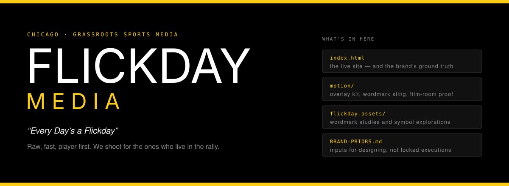

Tournament coverage and same-day photo drops for grassroots volleyball, out of Chicago. We
shoot for the players, not the brochure.

**[flickdaymedia.com](https://flickdaymedia.com)**

## What this repo is

The site itself — a static build, no framework, no build step. `index.html` is the whole
page. It deploys as-is.

| Path | Holds |
|---|---|
| `index.html` | The live site |
| `motion/` | Overlay kit, wordmark sting, film-room proof card — HTML motion pieces |
| `flickday-assets/` | Wordmark studies, symbol explorations, mock sheets |
| `images/` | Site imagery |
| `BRAND-PRIORS.md` | The inputs a designer needs before making anything |

## The site is the brand, not a doc about the brand

`BRAND-PRIORS.md` is deliberately not a spec of locked executions. It records the irreducible
true things — name, tagline, mission, audience, personality, palette — and stops there.

It says so in its own first lines, and it earned the right to: a 40-file render pipeline and a
generated brand kit were deleted in July 2026 because they had fossilized a March brand into a
god-module that drifted from the live site. The old `DESIGN.md` claimed an Inter body font and
an Event-Orange accent. The site used neither.

So the rule is written down: **ground truth is `index.html`.** When a generated artifact and
the site disagree, the site wins.

## Identity

Yellow on black is the whole thing.

| | |
|---|---|
| `#facc15` | Yellow — the identity |
| `#fde047` | Yellow, bright |
| `#000000` | Black — the ground |
| Display | Anton |
| Body | Inter |
| Labels | JetBrains Mono |
| Tags | Barlow Condensed |

## Run it

```bash
git clone https://github.com/nino-chavez/flickdaymedia.git
cd flickdaymedia
python3 -m http.server 8000
```

Open `http://localhost:8000`.

## Shooting with us

Tournament organizers and players: nino@ninochavez.co.
